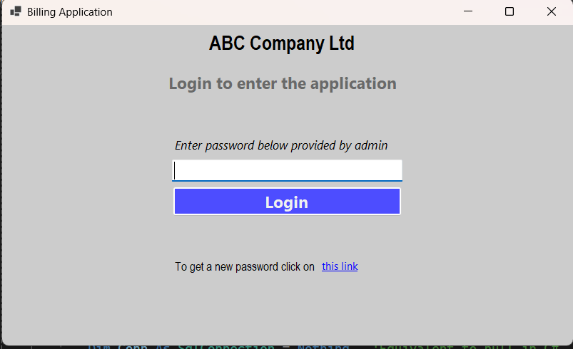

# VB.NET-WinForm-Invoice-creation
How to build a GUI application using VB.NET. Here i have created a Windows Form which create invoice. It also displays all the invoice records based on shop id.  
## Login screen

